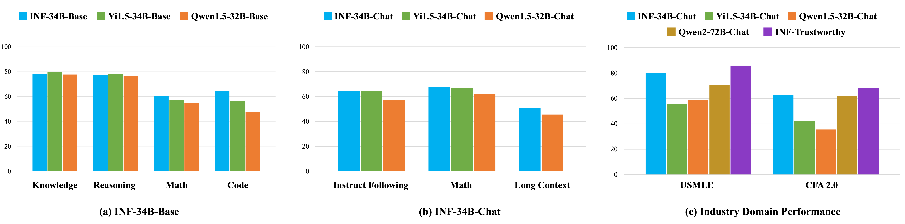
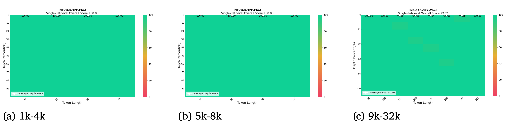
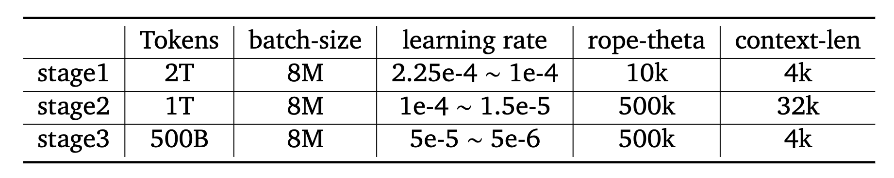

<div align="center">
  
</div>
<hr>
<div align="center">

  <a href="https://chat.infly.cn/" target="_blank">
    
  </a>
  <a href="https://huggingface.co/infly-ai" target="_blank">
    
  </a>

</div>

<p align="center">
  <a href="https://www.infly.cn/en/research"><b>Paper Link</b></a>
</p>


## 1. Introduction

INF-34B has 34 billion parameters with a context window length of 32K, and is trained on about 3.5T well-processed tokens from English and Chinese bilingual corpus. Compared with open source models of the comparable size, INF-34B not only provides competitive performance in the OpenCompass evaluation, but also has impressive potential on both finance and healthcare domains. Besides, the quantized INF-34B runs on graphics cards of 24GB VRAM with negligible accuracy loss, which facilitates commercial applications, especially low-resource scenarios.

<div align="center">
  
</div>

 - **Detailed for Training GPT Model:** We provide comprehensive details about our model pretraining and alignment, including high-quality data pipeline, instruction data preparation, and quantization results etc.

 - **Superior Performance on Benchmarks:** We demonstrate superior performance of the INF-34B models by comparing against two competitors with comparable model size, Qwen1.5-32B and Yi1.5-34B, on the public OpenCompass benchmarks.


## 2. Models

We release the base and chat models with 34B parameters based on the LLaMA framework, while using LayerNorm with zero-centered gamma instead of RMSNorm for training stability. Please **note** that you could use our models for commercial applications under the terms outlined in [License section](#6-license).

### Huggingface

|         Model         | Sequence Length |                                Download                                 |
|:---------------------:|:---------------:|:-----------------------------------------------------------------------:|
| INF-34B-Base  |      32K       | 🤗 [HuggingFace](https://huggingface.co/infly/INF-34B-Base)  |
| Inf-34B-Chat  |      32K       | 🤗 [HuggingFace](https://huggingface.co/infly/INF-34B-Chat)  |
| Inf-34B-Chat-GPTQ-4bits  |      32K       | 🤗 [HuggingFace](https://huggingface.co/infly/INF-34B-Chat-GPTQ-4bit) |
| Inf-34B-Chat-GPTQ-8bits  |      32K       | 🤗 [HuggingFace](https://huggingface.co/infly/INF-34B-Chat-GPTQ-8bit) |
| Inf-34B-Chat-AWQ  |      32K       | 🤗 [HuggingFace](https://huggingface.co/infly/INF-34B-Chat-AWQ) |


## 3. Benchmarks

**Note:** If you want to reproduce the evaluation results, please refer to the [details of evaluation](./evaluation/Evaluation.md), including prompts,  postprocess scripts and version of inference frameworks.

### Base Model

We evaluate our model on several academic benchmarks then compare with other similar-sized open access model. INF-34B has stronger performance in the fields that we chose to optimize while simultaneously preserves the general capabilities of LLM such as commonsense, world knowledge, math and coding.

|      model      | QWen1.5-32B | Yi1.5-34B |  INF-34B |
|:---------------:|:-------------:|:------------:|:------:|
| MMLU(5-shot) |     73.60      |     77.86     |    76.11    |
| CMMLU(5-shot) |     81.87      |     81.85    |    80.08   |
| GSM8K(4-shot) |      72.86     |     80.06     |    83.02    |
| MATH(4-shot) |     36.80     |     33.88     |    38.34    |
| HumanEval(0-shot) |     44.51      |     47.56    |    65.24    |
| MBPP(3-shot) |     51.00      |     65.60     |    64.00    |
| BBH(3-shot) |     70.60     |     74.83    |    71.20    |
| HellaSwag(0-shot) |     82.03      |     81.57     |    83.32    |


**Note:** To facilitate reproduction, the results of common benchmarks are generated by [OpenCompass](https://github.com/open-compass/opencompass) except humaneval and mbpp as we experience code timeout and postprocess issues. Besides, Usmle and CFA is evaluated using internal evaluation scripts.

### Chat Model

We present the performance results of our chat model and other LLM on various standard benchmarks, as well as two domain-specific benchmarks.

|      model      | QWen1.5-32B-Chat | Yi1.5-34B-Chat |  INF-34B-Chat |
|:---------------:|:-------------:|:------------:|:------:|
| MT-bench |     8.3     |     8.5    |    8.3    |
| AlignBench |     7.1      |     7.2     |    7.1    |
| IFEval |     49.54     |     58.04     |    59.70    |
| Arena-Hard |     24.2      |     42.6     |    43.1    |
| GSM8K |     81.42      |     79.45     |    84.04    |
| MATH |     42.28      |     54.06     |    51.48   |
| USMLE |     58.70     |     55.84     |    79.70    |
| CFA 2.0 |     35.5      |     42.5     |    62.75    |


### Long Context

We employed a long context SFT dataset of various length. Specifically, 37.7% shorter than 8k tokens, 40.5% falling within 8k to 16k tokens and 21.8% ranging from 16k to 32k tokens. And  Our model has demonstrated superior performance on LongBench(via [OpenCompass](https://github.com/open-compass/opencompass)) tasks compared to Qwen1.5-32B.


|      model      | Single-Doc<br>QA | Multi-Doc<br>QA |  Summari-<br>zation | Few-shot<br>Learning | Synthetic | Code |
|:---------------:|:-------------:|:------------:|:------:|:------:|:------:|:------:|
| QWen1.5-32B-Chat |     45.6      |     40.4     |    23.1    |    52.6    |    67.3    |    43.8    |
| INF-34B-Chat |     47.4      |     43.2    |    24.1    |    66.0   |    66.8    |    57.2    |

**Note:** All the reported results on the table are the average of sub-tasks for different categories.

INF-34B-32k also performs well across context window lengths up to 32k on Single-Needle RetrievalTask(S-RT) as visualized below.
<div align="center">
  
</div>

## 4. Training Details

### Data Pipeline

 We propose different data pipelines for general, domain and code data to ensure the richness, variety and quality of training samples. The general data pipeline involves general processing methods. For the domain data of interest, e.g., math, wiki, code, we propose a domain-specific data pipeline to extract the domain data from Common Crawl (CC). We also devise a code-specific pipeline to handle massive code data, since the code data has proven its effectiveness in improving the model’s reasoning and comprehension ability.

- **General Data Pipeline**: Our text cleaning pipeline mainly includes two stages: filtering and deduplication. The filtering involves language identification, URL filtering, and heuristic filtering rules. The deduplication includes both fuzzy deduplication and exact deduplication techniques.

- **Domain Data Pipeline**: We propose an iterative high-quality data retrieval method that recalls relevant data from the Common Crawl (CC) dataset for various target domains. It comprises three main component: FastText training, Performing recall and Human annotation.

- **Code Data Pipeline**: The code-specific data processing pipeline includes modules of preprocessing, heuristic filtering, deduplication, transformation and data mixture.

### Training Settings

The architecture choices of INF-34B follows LLaMA framework. Specifically, we opt Rotary Embedding for positional encoding, SwiGLU for activation function, Grouped Query Attention (GQA) and LayerNorm with zero-centered gamma instead of RMSNorm for training stability.

Motivated by the idea of first training on relatively large but less polished corpus to equip the model with language understanding and world knowledge and then improves model’s domain knowledge and reasoning ability, our training process is split into 3 stages:
- Stage 1: The dataset mainly includes web text, paper, Wikipedia and source code. In this early stage, we aim at larger data and higher diversity.
- Stage 2: For second stage we seek to gradually challenge the model with longer and more complex texts. We up-weight long texts in the same data distribution of stage 1. We tune the rope base and extend our context window to 32k for more sophisticated comprehension of human knowledge.
- Stage 3: The final stage is composed of domain data recalled from Web text and synthetic data.

<div align="center">
  
</div>

## 5. Inference

### Installation

Install the dependencies for `Python >= 3.8` by running the following command:

```shell
pip install -r requirements.txt
```

### Inference with Huggingface's Transformers

We provide the inference examples with [Huggingface's Transformers](https://github.com/huggingface/transformers).

**Text Generation with Base Model**

```python
import torch
from transformers import AutoTokenizer, AutoModelForCausalLM, GenerationConfig

model_name = "infly-ai/INF-34B-Base"
tokenizer = AutoTokenizer.from_pretrained(model_name, trust_remote_code=True)
model = AutoModelForCausalLM.from_pretrained(model_name,
                                             torch_dtype=torch.bfloat16,
                                             device_map="auto",
                                             trust_remote_code=True)
model.generation_config = GenerationConfig.from_pretrained(model_name)
model.generation_config.pad_token_id = model.generation_config.eos_token_id

inputs = tokenizer("对酒当歌，", return_tensors="pt")
outputs = model.generate(**inputs.to(model.device), max_new_tokens=100)

result = tokenizer.decode(outputs[0], skip_special_tokens=True)
print(result)
```

**Text Generation with Chat Model**

```python
import torch
from transformers import AutoTokenizer, AutoModelForCausalLM, GenerationConfig

model_name = "infly-ai/INF-34B-Chat"
tokenizer = AutoTokenizer.from_pretrained(model_name, trust_remote_code=True)
model = AutoModelForCausalLM.from_pretrained(model_name,
                                             torch_dtype=torch.bfloat16,
                                             device_map="auto",
                                             trust_remote_code=True)
model.generation_config = GenerationConfig.from_pretrained(model_name)
model.generation_config.pad_token_id = model.generation_config.eos_token_id

messages = [
    {"role": "user", "content": "Who are you?"}
]
input_tensor = tokenizer.apply_chat_template(messages, add_generation_prompt=True, return_tensors="pt")
outputs = model.generate(input_tensor.to(model.device), max_new_tokens=100)

result = tokenizer.decode(outputs[0][input_tensor.shape[1]:], skip_special_tokens=True)
print(result)
```

You can also interact with our model following the sample template without `apply_chat_template`. You should tokenize the completed templates as the base model does for more flexible usage.

```
<|start|>user
messages[0]['content']<|end|>
<|start|>assistant<|message|>{messages[1]['content']}<|end|>
<|start|>user
messages[2]['content']<|end|>
<|start|>assistant<|message|>
```

## 6. License

INF-34B series (including Base and Chat) support commercial applications under a permissive [License](https://github.com/infly-ai/INF-LLM/blob/main/LICENSE).

## 7. Citation

```
@article{inf-llm,
  author = {INF-Team},
  title = {INF’s Open-Source Large Language Models},
  year = {2024},
  url = {https://github.com/infly-ai/INF-LLM}
}
```

## 8. Contact

If you have any questions or seek for cooperation, please contact us at [bd@infteach.ai](mailto:bd@infteach.ai).
